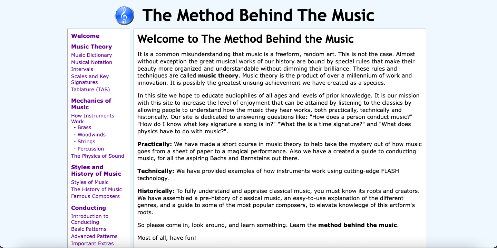
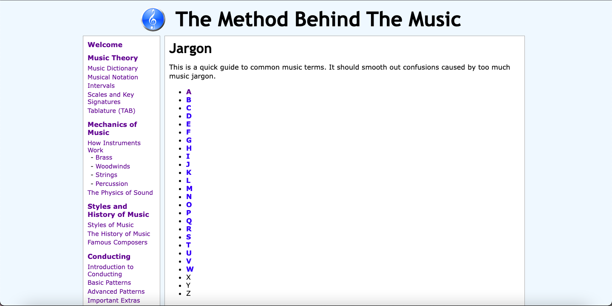
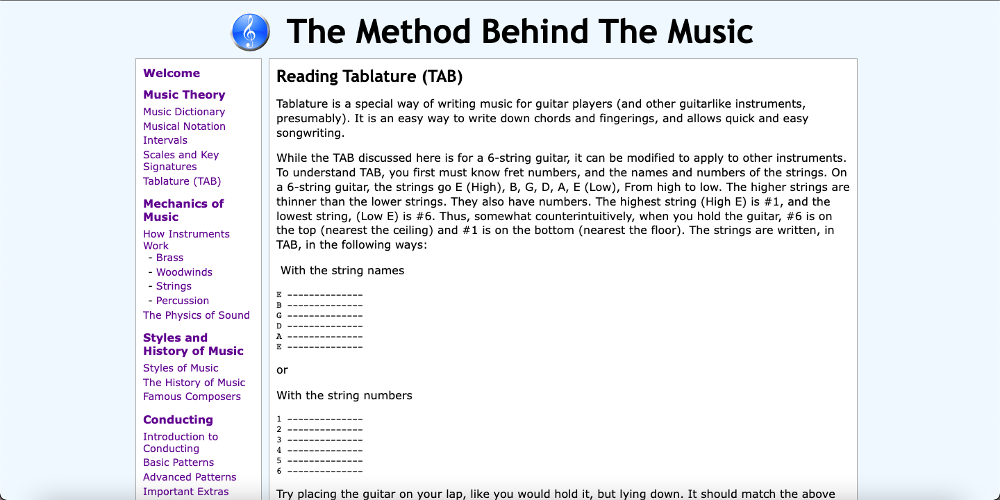
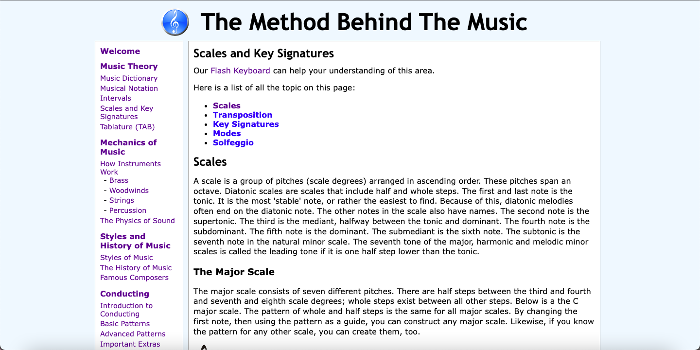

# DH110 Assignment 1: Heuristic Evaluation by Cindi Dong
## Music Theory
I had originally planned to do my analysis on two music/beat composition websites, as I am interested in how music is created. However, I found most of these websites required some basic music theory knowledge to begin with. I don't know much about music, so I thought it would be better for me to focus on music theory for beginners instead. Thus, the purpose of my project is to provide a fun, easy to understand, and clean website to learn music theory. To do, I will analyze two music theory websites through the lens of [Jakob Nielson's usability heuristics](https://www.nngroup.com/articles/ten-usability-heuristics/) and [Nielsen Norman Group's severity ratings for usability problems](https://www.nngroup.com/articles/how-to-rate-the-severity-of-usability-problems/). Both of these websites were found through a simple Google search for music theory.
## Website 1: [Method Behind the Music](https://method-behind-the-music.com/)
### About
I found Method Behind the Music through a Google search for music theory, similar to how the target audience of mid-aged men might find it. It is a simple website aimed at teaching music theory for all skill levels. In addition to this, they also have information on instruments and music history. The website has a table of contents on the left side, where the user can navigate to the lesson they need.

### Heuristic Evaluation
#### Overall Evaluation
This website has major issues, mostly relating to the difficulty of lesson/page navigation with the table of contents. A complete revamp of this feature should be the main area of focus. Likewise, this website has the basic HTML design of older websites and no interactive elements, which makes it boring and uninteresting. Overall, this website wouldn't be suitable for the target audience of mid-aged men.

#### 1: Visibility of system status
- This website has a table of contents on the left side, but it doesn't highlight which section/page you are currently on. This makes it hard for the user to determine which page they currently are on. (3)

*Solution: Make the current page unclickable on the table of contents.*

- Some page titles/headers do not match the corresponding entry in the table of contents. In the below example, we are actually on the Music Dictionary subsection under the Music Theory section. This makes it hard for the user to determine which page they currently are on. (3)

*Solution: Make sure all page titles/headers match the corresponding entry in the table of contents.*

#### 2: Match between system and the real world
- A convention for most lesson based websites is to have next button at the bottom of the page. This allows the user to easily navigate to next lesson without having to go back to the table of contents to check for and click on the next lesson. This website doesn't have a next button. (3)

*Solution: Add a next button at the bottom of each lesson directing the user to the next lesson.*

#### 3: User control and freedom
- There is no button to go back to the previous lesson (besides the browser back button). (3)

*Solution: Add a back button to go back to the previous lesson.*

- Some pages are quite long, so the user might scroll far down the page before realizing they don't want to be on that page. (2)

*Solution: Add an up arrow button on each page to go back up to the top of the page.*

#### 4: Consistency and standards
- The Flash Piano, About Us, and Contact Us pages are part of the table of contents, which make them look like lessons to the user. (1)

*Solution: Move the Flash Piano, About Us, and Contact Us pages to a different area of the website separate from the table of contents.*

- Some lessons have their own table of contents, so you can skip to the subsection you want on the lesson. This tends to be longer lessons. However, some lessons don't have this table of contents, which tends to be shorter lessons. (1)

*Solution: Add a table of contents at the beginning of each lesson.*

#### 5: Error prevention
- It's easy to accidentally click an adjacent lesson in the table of contents, instead of the one you intended to click. (2)

*Solution: Change the color of the lesson your mouse is currently hovering over in the table of contents.*

#### 6: Recognition rather than recall
- The user has to remember which lesson they're on to navigate to the next lesson. (3)

*Solution: Add a next button on the current lesson page that directs the user to the next lesson, or make the current lesson unclickable in the table of contents.*

#### 7: Flexibility and efficiency of use
- A search function should be implemented, so users just looking for one particular concept can just search for it. (1)

*Solution: Add a search function.*

#### 8: Aesthetic and minimalist design
- The design is minimalist, but it is not aesthetic. It's a bare bones HTML website that could use a redesign, as it looks very uninteresting and boring. This doesn't affect the usability of the site, but more interactive elements would draw more users in. (3)

*Solution: Redesign the site to have a cohesive theme, a better color scheme, more interactive elements, etc.*

#### 9: Help users recognize, diagnose, and recover from errors
- This website doesn't take any user input, so there's little chance for any traditional errors. However, one of the major problems with this website is the page navigation is up to the user and their memory. This makes any user error in navigation (forgetting which page they're currently on so they can't navigate to the next page through the table of contents) almost impossible to recover from without clicking around a lot. (3)

*Solution: Add a next button in the current lesson page for the next lesson.*

#### 10: Help and documentation
- This website is pretty simple and shouldn't need that much documentation. As such, there is no FAQ page. However, there is a Contact Us page that opens the email application on your computer. (1)

*Solution: Add a FAQ page.*

## Website 2: [Music Theory](https://www.musictheory.net/)
### About
I found Music Theory through a Google search for music theory, similar to how the target audience of mid-aged men might find it. There are free music theory lessons, exercises, and tools. There are also paid premium apps for music theory, which they advertise heavily in the landing page. I will only be analyzing the [free music theory lessons section](https://www.musictheory.net/lessons), as this is the focus of my project (and I don't want to pay for the apps).

The [free music theory lessons section](https://www.musictheory.net/lessons) also serves as the table of contents, where you can view each section, subsection, and a short description of each subsection.

### Heuristic Evaluation
This website is obviously designed as a mobile app, even though it's a website. This is probably because this is a free preview of their paid music theory app. However, this means that many features of this website do not make sense. Music Theory should focus on redesigning specifically with a website in mind, rather than reusing the mobile app design. Similar to The Method Behind the Music, they also have issues with lesson navigation, which they should focus on to make the experience much less frustrating for the user. Thus, these issues and the ones further discussed below create a confusing experience for mid-aged men.

#### 1: Visibility of system status
- Once inside the particular lesson, there is no way to tell which section/chapter your current lesson is under. (2)

*Solution: Add the current chapter to the title of the current lesson page, i.e. "The Basics: The Staff, Clef, and Ledger Lines".*

- There is no indication on how many lessons are left in the section/chapter the lesson is in. (2)

*Solution: Add the number of lessons left in the chapter to the title of the lesson page, i.e. "The Staff, Clef, and Ledger Lines (1/12)".*

- There is sound for some animations in a particular lesson, which can be played by pressing the sound icon on the left of the content/script. However, this button is hard to see as it's small. (3)

*Solution: Automatically play the sound when on an animation with sound.*

#### 2: Match between system and the real world
- A convention for most lesson based websites is to have a next button for next lesson in the current lesson's page. This allows the user to easily navigate to next lesson. In this website, going to the next lesson means clicking on the home button on the top of the screen, which takes you back to the table of contents page. Then you have click on the next lesson, which is a lot of work. (3)

*Solution: Add a next button on the top to go to the next lesson.*

- Some animations in a lesson have sound, which can be played by pressing the sound icon on the left of the content/script. It can also be played when the same sound icon on the bottom is not greyed out and is pressed (see picture in 1: Visibility of system status). However, I thought this button was the volume control for the first method to play the sound (the sound icon to the left of the content/script), and not a button to press for the actual sound to play. This is because most websites use that particular sound icon for volume control. (2)

*Solution: Change the sound icon to a play icon (to play the sound), or get rid of it and only keep the sound icon to the left of the content/script.* 

#### 3: User control and freedom
- There is no button to go back to the previous lesson/page, in case the user wants to revisit the last lesson. (3)

*Solution: Add a back button to the top to go back to the previous lesson.*

#### 4: Consistency and standards
- There is an option to view the lesson in image mode, instead of the standard slideshow mode. In the image mode, there are no animations and only images. This is understandable, as it is called image mode. However, there is also no sound option. Thus, the modes are not consistent with each other and the user is missing information when on image mode. (3)

*Solution: Add a sound button to the top left of the lesson subsection in image mode.*

#### 5: Error prevention
- The user may accidentally click on the slider on the bottom of the screen and skip to an unintended part of the lesson. (2)

*Solution: Get rid of the slider on the bottom of the screen.*

#### 6: Recognition rather than recall
- The user has to remember which page/lesson they're on to navigate to the next page/lesson. To go to the next lesson, you have to click on the home button on the top of the lesson, which takes you back to the table of contents page. Then, you have to remember the lesson you just were on, search for it in the table of contents, then click on the next lesson. (3)

*Solution: Add a next button on the current lesson page that directs the user to the next lesson.*

#### 7: Flexibility and efficiency of use
- This website has keyboard shortcuts (left and right arrow) to move onto the next animation, but there's none to play the corresponding sound. (2)

*Solution: Play the sound when the space bar is pressed.*

- A search function should be implemented, so users just looking for one particular concept can just search for it. (1)

*Solution: Add a search function.*

#### 8: Aesthetic and minimalist design
The lesson pages look like they were designed as a mobile app, then sloppily converted into a web application. 
- The icons on the top are the same as the ones for Android apps, and there is no ability to hover over the home button to display a larger menu. You don't have the ability to hover in apps, but you can provide a larger breadth of information with minimum space on a website with hovering. (2)

*Solution: Allow the user to hover over the home button to produce the table of contents.*

- The slider on the bottom of the screen in slideshow mode is unnecessary and looks like it belongs in a mobile app instead a web application, as it's harder for mobile users to scroll. (1)

*Solution: Remove the slider.*

- The ratio between the animation and the content/script is designed for mobile. When the screen is larger, the animation is much larger than the content, so it's hard to read the content. When the screen is smaller, the ratio is more similar and the content is much easier to read. There is no option to adjust the size of the content as well. (3)

*Solution: Redesign the ratio between the animation and the content for users with large computer screens*

#### 9: Help users recognize, diagnose, and recover from errors
- This website doesn't take any user input, so there's little chance for any traditional errors. However, one of the major problems with this website is the lesson navigation is up to the user and their memory. This makes any user error in navigation (forgetting which page they're currently on so they can't navigate to the next page through the table of contents) almost impossible to recover from. (3)

*Solution: Add a next button in the current lesson page for the next lesson.*

#### 10: Help and documentation
- This website has a [FAQ page](https://www.musictheory.net/faq), but it's located at the bottom of every page in small text. It can also be accessed as a link in the [Contact Us page](https://www.musictheory.net/contact). (1)

*Solution: Move the FAQ page to the main menu on the top, alongside the Contact Us page.*

