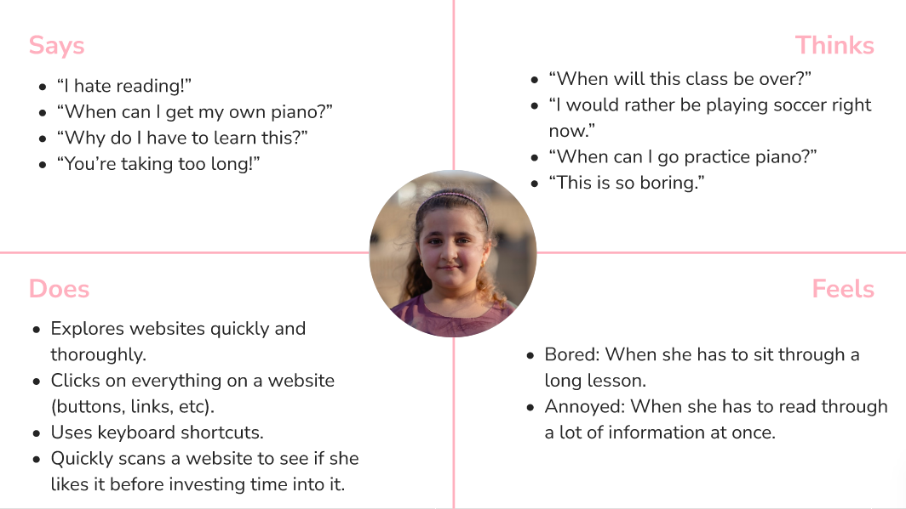

# DH110 Assignment 4: Persona + Scenario by Cindi Dong
## Introduction
The purpose of UX storytelling is to put yourself into your user's shoes to better understand how to design the product for your target audience. In my case, I brainstormed 3 users/personas with varying prior knowledge on music theory and reasons to learn. To put myself in their shoes, I created empathy maps and journey maps to understand their pain points.

## New Features
### Landing/Front Page
- Landing page is the table of contents.
- Remove the giant advertising for the paid app version, users will buy the app if they enjoy the free content (can add a link for more paid lessons at the end of the table of contents)
### Lessons
- Textbook format (all text with interactive elements scattered in-between)
- Interactive elements (quizzes at the end of the lesson, opportunities to play the piano or the chords themselves)
- Once you click on the menu button, it opens to a mini table of contents without going back to the table of contents page

## Personas, Scenarios, and Journey Maps
### Harold
#### Persona + Empathy Map

#### Scenario
##### Why?
> Harold has always loved the Beatles, and they have been his favorite band since his youth. He especially loves their iconic guitar lines, and has always wanted to be able to play along with them. Now that he finally has time for his interests after his retirement, he has been learning guitar for about 3 months. However, Harold realized he needed to learn how to read sheet music to be able to play along, but he doesn't want to use his retirement funds to pay for in-person lessons. He calls his daughter to tell her about his dilemma, and his daughter suggests a free website to learn music theory.

##### How?
> Harold opens his email, and clicks on the email from his daughter containing the free music theory website link. He copies the website link and pastes it on the search bar of his browser instead of clicking on the link, and is taken to the website. Harold is greeted with a table of contents, or a list of all the lessons grouped by section, instead of a landing page with links to the paid apps (he would have trouble finding the free music lessons page). He reads the first couple section names, and realizes he doesn't know these concepts. Thus, he clicks on the first lesson in the first section. This takes him to the lesson page, which is formatted similar to a textbook (the information is laid out as text on a single page, with images and interactive elements sandwiched in-between the text), instead of a slideshow of animations (which would be confusing to him, and he wouldn't click around to figure out how to see the animations). He reads through the lesson, and continues onto the next lesson with the next button at the bottom of the lesson. Once finished with both lessons, he decides he had enough for the day. He bookmarks the page (as his daughter taught him) for next time and closes the browser.

#### Journey Map

### Olivia
#### Persona + Empathy Map

#### Scenario
##### Why?
> Olivia has always been a high energy, active child. She's been on the soccer team ever since elementary school, which helps her release some energy. In addition, her mother started introducing her to classical music, in hopes to calm her down. This somewhat worked, and Olivia discovered that she enjoys classical music quite a lot. Not satisfied with just listening to classical music, Olivia wanted to be able to play it as well. She particularly enjoys the piano portions of the pieces, and wanted to try playing them herself. Her school doesn't have a music program due to budget cuts, so her mother talked their neighbor into letting her use their piano. Olivia is a very fast learner, but she has hit a roadblock. Olivia and her mother realized she needs to learn music theory to continue improving, but her mother can't afford lessons. Thus, she suggests that Olivia finds a free, online resource for music theory.

##### How?
> Olivia has 30 minutes before she has to go to soccer practice. She decides to spend this time looking for free music theory resources. Olivia opens her school issued Chromebook, and pulls up Google. She types in "free music theory lessons", and clicks on the first result. This leads her to the landing page with the table of contents, with the lessons separated into separate sections. She clicks into a random lesson to check if the website seems like a reputable resource. Olivia scrolls through to check the length of the lesson, which seems to have a lot of animations/pictures and interactive elements and a decent amount of text. She decides this website looks informative but interesting, and clicks the back button to go back to the table of contents. She takes a quick look at the section names, and clicks on the first lesson in the first section. She goes through the lesson, finding her attention slipping at times, but a well placed interactive element brings her back each time. She finishes the lesson, doing all the interactive elements (playing the piano in the lesson, etc), and continues to the quiz at the end of the lesson. She only missed one question. Once understanding her mistake, she moves onto the next lesson. In the middle of the lesson, she checks the time and realizes that it's time to leave for soccer practice. She closes her Chromebook and heads out for practice.

#### Journey Map

### John
#### Persona + Empathy Map

#### Scenario
##### Why?
> John has recently been hit with a mid-life crisis. He is unhappy with his current job, and regrets the path he chose in life. John's favorite genre of music is EDM. He admires the DJs/producers greatly, and wishes he had their young and free lifestyle. Deep in his mid-life crisis, John decided to attempt to pursue music production. He bought an online music production course, and some equipment. However, since music production relies heavily on music theory, the music production course requires at least an intermediate knowledge of music theory. John used to play the piano when he was a child, so he had some experience with music theory. However, this was definitely not enough for the course, and John realized he needs to fill in the gaps. John knows how to read sheet music and other basic music theory concepts, but he doesn't know more advanced concepts (chords, etc) necessary to music production. Thus, he needs to find a music theory resource to build on his basic knowledge.

##### How?
> John has been stuck on a lesson in his music production course that requires prior knowledge of basic chords for a while now. After getting off work and finishing his dinner, John decides now is as good a time as any to start learning about chords for his course. He opens his work laptop and pulls up Google. He types in "music theory chords", and clicks on the first result. John scrolls through the lesson to determine if it seems reputable. He decides this lesson looks informative but interesting, and returns to the top of the page to go through the lesson on chords. He enjoys the interactive elements interspersed throughout the text, allowing him to play the chords out loud to compare sounds and to create his own chords. Halfway through the lesson, it brings up the major scale. John realizes he forgot about scales. Since he's enjoying the lesson so far, he decides to search for the website's lesson regarding scales. He clicks on the menu button, which unfolds into a table of contents (while remaining on the chords lesson, instead of taking him to the table of contents page). He searches for the scale section, and clicks on the major scale lesson. He goes through the major scale lesson quickly, and clicks on the back button on the browser to return to the chords lesson. He completes the quiz at the end, and gets all the questions correct. John then returns back to his music production course, and finishes the lesson he was stuck on.

#### Journey Map

[Figma Link](https://www.figma.com/file/2iRvvC3z3jc8Mt34MsFPq2/User-Personas?node-id=104%3A452)
