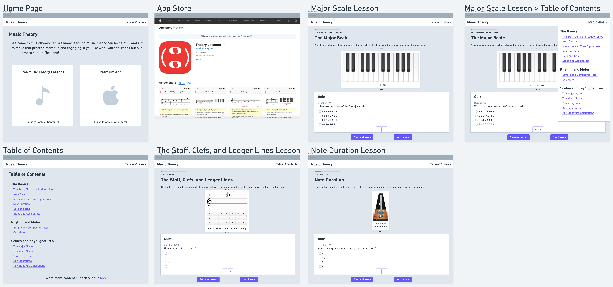

# DH110 Assignment 5: Low Fidelity Prototype by Cindi Dong
## Description
For my project, I have chosen to redesign https://www.musictheory.net/ with the goal of providing a fun, easy to understand way to learn music theory. From my user research/UI/CI testing, I learned that the website's animations are deeply flawed. Either users can't figure out how to play the animations, or they don't find them engaging or useful at all. In addition, I found users tend to prefer a more simple website, rather than a flashy one. From my CI testing, I learned that this website doesn't actually appeal to those with an intermediate knowledge of music theory at all, as they prefer a more textbook format they could skim over to brush up on their knowledge. In addition, I discovered that most users aren't interested in music theory itself, instead just learning music theory to improve on other skills they found more interesting (such as singing, piano, etc). With these discoveries in mind, I created 3 personas summarized below.
- Harold Miller is a 65 year old man who is looking to learn guitar to play along to his favorite band, the Beatles. He just needs to learn how to read sheet music, and is not very tech savvy. He needs a simple, easy to navigate website or else he will get overwhelmed. Since he's a beginner, his scenario consists of him discovering the website and starting from the beginning with the first lesson.
- Olivia Garcia is a 11 year old girl learning how to play piano. She needs to learn music theory to improve at piano, but is very easily distracted and full of energy (as she is a child). She needs a heavily interactive website, with lots of content to keep her entertained. Olivia is also a beginner, so her scenario consists of her discovering the website and completing the first lesson as well.
- John Williams is a 45 year old man who has prior knowledge of music theory. He is currently going through a music production course, and needs to brush up on some concepts. He needs to be able to easily search for a particular concept, and learn it quickly. His scenario sees him jumping from lesson to lesson. He originally discovers the website to learn about chords, but needs to complete the major scales lesson before continuing with the chords lesson.

From these scenarios, I came up with new features:
##### Landing/Front Page
- Landing page is the table of contents.
- Remove the giant advertising for the paid app version, users will buy the app if they enjoy the free content (can add a link for more paid lessons at the end of the table of contents)
##### Lessons
- Textbook format (all text with interactive elements scattered in-between)
- Interactive elements (quizzes at the end of the lesson, opportunities to play the piano or the chords themselves)
- Once you click on the menu button, it opens to a mini table of contents without going back to the table of contents page

I created the following tasks to showcase the new features:
##### Tasks
1.  Find the first lesson (the Staff, Clefs, and Ledger Lines), then go to the next lesson (Note Duration), then go back to previous lesson (the Staff, Clefs, and Ledger Lines).
2.  Find a particular lesson (the Major Scale), then go to a particular lesson (the Staff, Clefs, and Ledger Lines).`
3.  Find the paid content/app.

The purpose of low-fidelity prototyping to take these tasks created from the process I've detailed above to develop visuals. This allows for testing of my new features' functionality and integration with the website before investing time and effort into actual development.

## Wireframes

Please look at the [Wire Frames Whimsical link](https://whimsical.com/dh-110-wire-frames-8pFewvTjrHqtBBqxMr3MmS) if the image is too small.

## Wireflow
### Legend
-  ` Task 1`
-  ` Task 2`
-  ` Task 3`

Please look at the [Wire Flow Whimsical link](https://whimsical.com/dh-110-wire-flow-F4QTy2sbHNRrqpZ4Xx7VRN) if the image is too small.

## Testing Wire Flow
### Methodology
Since my wire frames are on Whimsical, I had to adapt the test a little. I conducted this test in person, so I had the wire frames open on my computer screen. I followed the Demo Material in Note 02 of the instructions, but instead of marking on the wire frames themselves, the participant told me which element they wanted to interact with and which frame they thought would be next. Then I highlighted/created arrows for the participant at those interaction points and connected the arrow to the next frame they chose. I also noted what they said in the comment at the particular element/interaction point that sparked the comment. That way, the participant didn't have to learn how to use Whimsical.
### Notes
1. The participant sucessfully completed all tasks.
2. For some reason, exporting the board removes the comments from the png picture, but the comments can be found in the [Whimsical link](https://whimsical.com/dh-110-testing-wire-flow-RNMQqsmtNKkvVCLBL4emfZ).
### Legend
-  ` Task 1`
-  ` Task 2`
-  ` Task 3`

#### Task 1

#### Task 2

#### Task 3

Please look at the [Testing Wire Flow Whimsical link](https://whimsical.com/dh-110-testing-wire-flow-RNMQqsmtNKkvVCLBL4emfZ) for the comments.

## Reflection
I found using Whimsical to create wire frames/wire flows was much easier than drawing it out (at least for me). However, I did get kind of carried away with designing it compared to if I just drew it out, as it was pretty fun to add new elements. It's definitely not the final design, but it does have more design than wire frames/wire flows usually have. When creating the wire frames/wire flows, I took into account the feedback I was given in my UT and CI. Those participants had found the website somewhat confusing. Likewise, one of my personas was Harold Miller, an elderly man who isn't tech savvy. Therefore, I wanted to keep the website simple and easy to understand. I believe I succeeded, as the participant had no trouble navigating through the website and I managed to predict their actions with my original wire flow pretty well. I also wanted to ensure the website was suitable for those with prior music theory knowledge, due to the participant in my CI and my persona John Williams. I converted the format to a textbook format, allowing for fast scans through the content. Likewise, I wanted to keep in mind my young, distractible persona of Olivia Garcia. I kept her in mind when I added interactive elements to the lessons.

I struggled with deciding what to keep from https://www.musictheory.net/. The original website has an exercises tab, which has exercises to practice music theory. This is located in a different paid app than the paid app for music theory. I placed these exercises in the corresponding lesson that taught the skills needed for the exercises, because I thought it would be better to combine these two functions into one and this provides more interactive elements in a lesson. Likewise, I wasn't sure if I wanted to keep the paid app or have any content locked behind a paywall. I eventually decided to keep some content locked in the paid app, as this website doesn't have ads or any other income source to support itself. However, the participant noticed this, and pointed out that it didn't make sense for the paid content to be in an app format when the free content was in a website format. They pointed out that this website was like a "free trial", and the user should be able to access more music theory lessons in the same website once they pay. For this, the user needs to be able to create an account. Therefore, I need to add more wire frames and wire flows for the account creation process, the payment process, the user's account page (delete account, keep track of user's progress, etc), and what the new content looks like (shouldn't be different in format from free content, just more advanced topics). The other pointers the participant gave me could be addressed by a working website (seeing the mouse hover over something, etc). In addition, I had expected the participant to return to the previous lesson by clicking the previous lesson button (at the bottom of the lesson page), but they just used the browser back button. I think it had to do with the task, as they had just been on the previous lesson. If I had asked them to go to the previous lesson from a random lesson, they wouldn't have been able to use the browser back button and would have had to use the previous lesson button.
