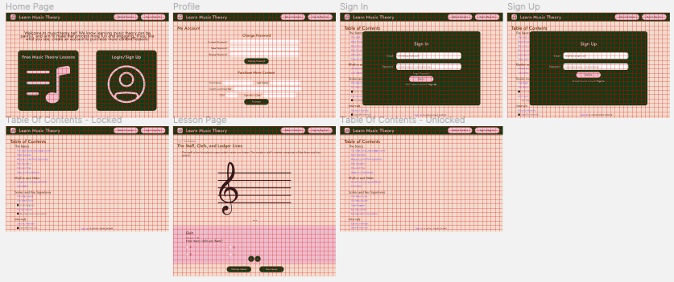

# DH110 Assignment 6: Interface Design by Cindi Dong

## Description

## Screen Design
[Figma Link](https://www.figma.com/file/GRkSbG8OGLDvrIpTIYnf0m/Materal-Design-for-desktop---Dashboard-UI-kit?node-id=13%3A3633)

### Layout Design

### Typographic Variations

### Shape Variations

### Color Variations

## Impression Test
https://youtu.be/r1hdPrT2sJQ

## Accessibility Check
### Background Color Contrast Check

### Button Color Contrast Check

### Quiz Color Contrast Check

## Design System

### Typeface

### Color Scheme

### Layout
