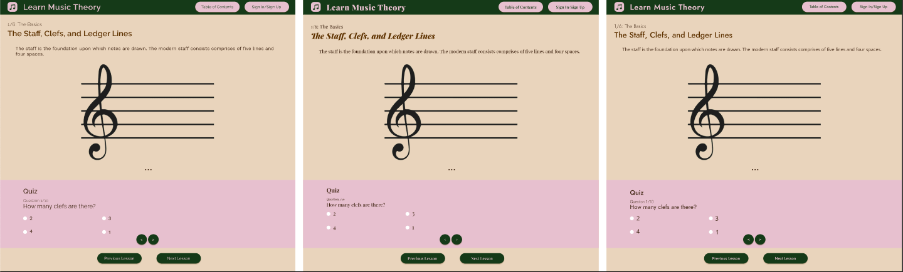

# DH110 Assignment 6: Interface Design by Cindi Dong

## Description
The goal of this assignment is to redesign https://www.musictheory.net into a more fun, interactive way to learn about music theory.

## Screen Design
[Figma Link](https://www.figma.com/file/GRkSbG8OGLDvrIpTIYnf0m/Materal-Design-for-desktop---Dashboard-UI-kit?node-id=13%3A3633)

### Layout Design

### Typographic Variations

### Shape Variations

### Color Variations

## Impression Test
[Youtube Link](https://youtu.be/r1hdPrT2sJQ)
### Overall Impression
The participant could tell immediately that the website was for learning music theory, and thought it looked interesting.

### Typography
The participant preferred the last variant, as they described it as having more "character" than the other fonts. I was surprised by this, as I had designed the website with the first variant's font in mind. I did see their point, as I found the last variant's font to be more modern and playful than the first one.

### Shape 
The participant preferred rounder buttons, but stated that this might be a personal preference. They did not like the rectangle buttons on the last variant, stating that it makes the website look unfinished.

### Color 
The participant preferred the second variant, as they preferred the higher contrast between the background and the text (compared to the first variant). I was also surprised by this, as I designed the website with the first variant. They also liked the idea of a dark mode.

### Results
I changed my design to have the 3rd typography (Jost) variant and the 2nd color variant (lighter background).

## Accessibility Check
### Background Color Contrast Check

### Button Color Contrast Check

### Quiz Color Contrast Check

## Design System

### Color Scheme
- Background: #EBDED1
- Header Text: #5A340E
- Body Text: #3C2415
- Link: #6558F5
- Disabled Link: #5F5E70
#### Accent Colors
- Pink (for quiz section, buttons, cards): #E1C3CF
- Green (for navbar, buttons, cards, sign in/sign up modal): #1F381B
> I went back and forth with the color scheme. I knew I wasn't going to follow the https://www.musictheory.net theme, as it is quite simple and designed for a mobile experience. When I started working on this, I had planned to go with a more academic color palette (beiges, tans, neutrals) reminiscent of coffee, but I thought it was rather boring and old looking once on Figma (can be seen in the 3rd variation in Color Variations section). I wanted to make the website more visually interesting and slightly modernized, so I added the pink and green colors as accent colors.

### Typeface
- Page Headers: Jost, 43
- Lesson Title/NavBar Title: Jost, 40
- Body/Table of Contents Links: Open Sans, 24
- Button: Jost, 20
> As I aimed to make the website seem a little more modern, I chose the sans-serif font of Jost for my headers. It looks very clean, slightly modern, and easy to read. To me, it feels playful, inviting, and friendly. In addition, there were many different weight options. I was working with a 14" MacBook Pro, so I couldn't make the text too big. However, small, cramped text makes the user lose interest, so I made the page headers size 43. I chose the sans-serif font of Open Sans for the body text in the lesson. It's more condensed than Jost (the characters are closer together), while remaining easy to read. I made the body text size 24, as to be almost half of the headers while still remaining readable.

### Layout
- Grid: 40px grid (distance between each grid box is 40px)
> I chose a 40px grid instead of doing rows/columns, because my website has a lot of lines of text (table of contents page). Thus, a smaller grid allows me to arrange these lines of text appropriately, while still allowing me to add chunks of text or images later on (the lessons page). I had margins of 1 grid box (40px).
