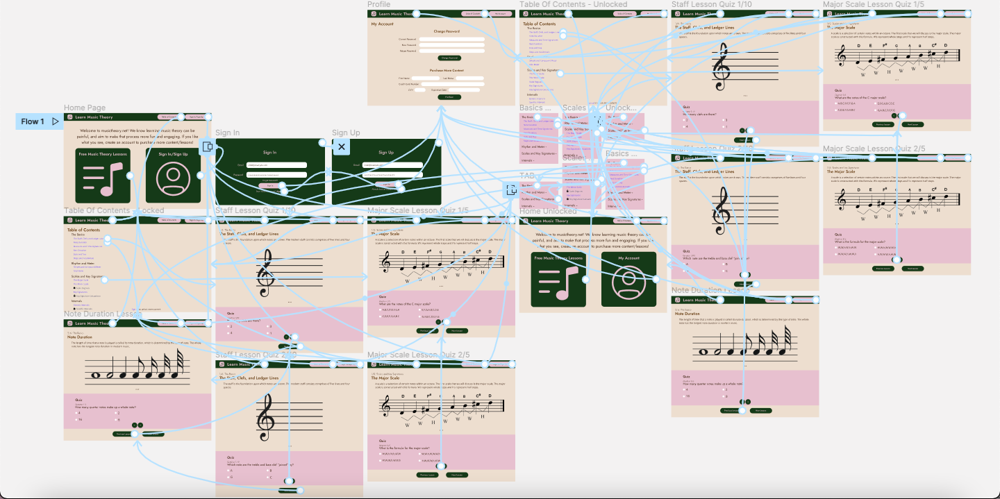
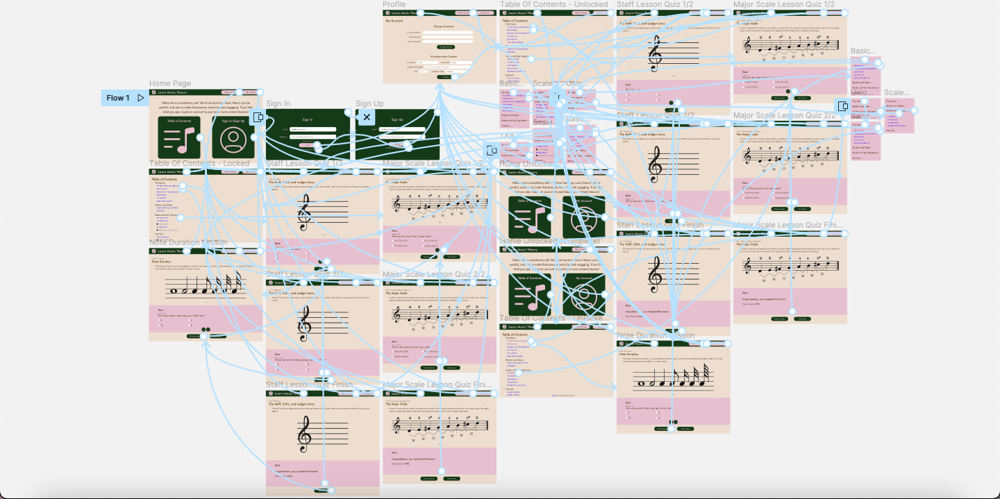
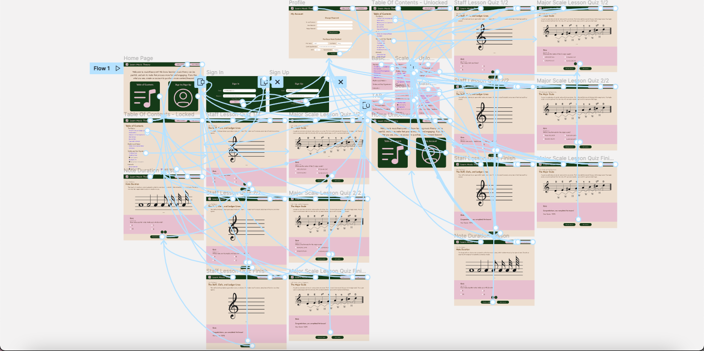
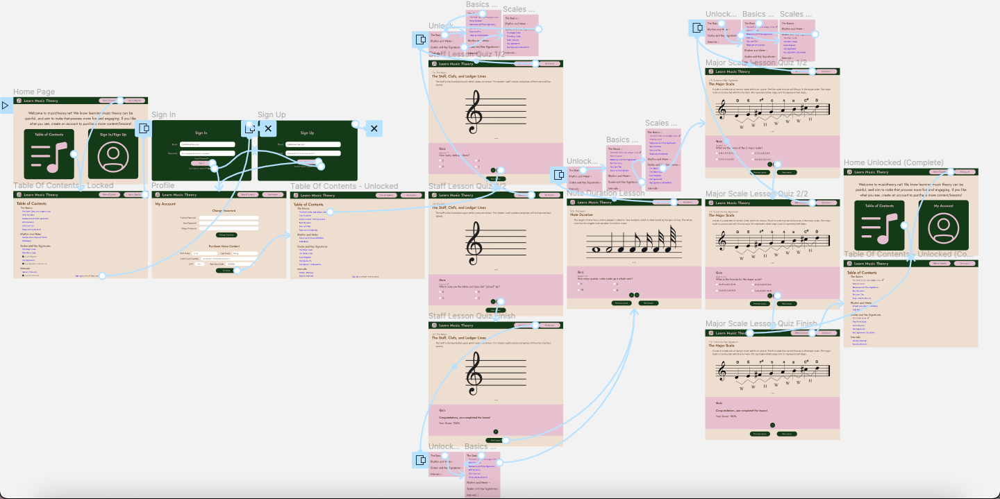

# DH110 Assignment 7: High Fidelity Prototype by Cindi Dong

## Description
The purpose of this assignment is to develop a high fidelity prototype of my redesign of https://www.musictheory.net/ (rebranded as Learn Music Theory). This is to mainly validate the interaction flow sketched out in the low fidelity prototype, and to continue improving upon the interface design. I used Figma to create wire frames, and Figma's prototyping tools to create these high fidelity prototypes. Then, I conducted cognitive walkthroughs and usability testing (UT) to continue improving upon these high fidelity prototypes.

### Tasks
- Not logged in: Navigate to 3 lessons and complete (by finishing the end of lesson quiz) 2 lessons.
- Logged in: Login, "purchase" the rest of the content, and view user progress.

## Prototype
### Iteration 1

[Figma File](https://www.figma.com/file/r0msWDlELGlAJWSloyPOQg/Cognitive-Walkthrough?node-id=117%3A2652)

[Figma Prototype](https://www.figma.com/proto/r0msWDlELGlAJWSloyPOQg/Cognitive-Walkthrough?node-id=117%3A2653&scaling=scale-down&page-id=117%3A2652&starting-point-node-id=117%3A2653)

### Cognitive Walkthrough
[Link to Comments](https://docs.google.com/document/d/1SOS-NN-_a3UrTWoGuX56GD1WqbyoErZwoCBFRIQ4-U8/edit)
#### Summary
- Participants all commented that there was no way for a user to feel as if they're making progress towards their goal (learning music theory).
- Participant thought the purple link color was confusing (as purple usually means a link has already been visited). They liked the idea of it being obviously a link, and recommended making it blue instead (for an unvisited link).
- Participants thought the discrepancy between the "Free Music Theory Lessons" card on the Home page and "Table of Contents" button in the NavBar was confusing.
#### Reflection
I conducted this cognitive walkthrough in class, with my peers. I used this [Google Form provided in class](https://forms.gle/medD2E1pU6PnJeeo7) as a script, and the participants filled out the [reviewer form provided in class](https://forms.gle/b4ZAd5yDbuoVHL2PA). I found this very insightful, as I had not thought about users feeling as if they're making progress towards their goal. I more thought of this as an informative website, similar to a textbook. Someone in my group had also chosen to redesign https://www.musictheory.net/, and I found it interesting to see how we designed our prototypes differently. I chose to completely redesign it, and she chose to keep more of the original elements of the website (such as the animations).

### Iteration 2

[Figma File](https://www.figma.com/file/Hg4KMbU53R7l7LcXRgAiyJ/Cognitive-Walkthrough-2nd-Draft?node-id=117%3A2652)

[Figma Prototype](https://www.figma.com/proto/Hg4KMbU53R7l7LcXRgAiyJ/Cognitive-Walkthrough-2nd-Draft?node-id=117%3A2653&scaling=scale-down&page-id=117%3A2652&starting-point-node-id=117%3A2653)

#### Changes
- Added ability to store user progress when signed in (the user's completed lessons have a checkmark next to it in the Table of Contents page).
- Must finish quiz to "complete" a lesson.
- Added ability to retake quiz.
- Changed links to lessons to standard blue color when not visited, and standard purple color when visited (matching HTML link behavior).
- Changed the "Free Music Theory Lessons" card on the Home Page to "Table of Contents".

### UT Testing
[Participant link to survey](https://forms.gle/4chXd5oDrXBnaATR6)

[Collaborator Link to survey](https://docs.google.com/forms/d/14V49gmvPEK9X0c57B8RyRUY48ZumZoOWZBBt6ghBLmk/edit?usp=sharing)

[Link to UT testing YouTube video with screen recording](https://youtu.be/eqiJ-iYZjSw)

#### Summary
- Participant was able to navigate around the new website much more easily than the old version.
- Participant liked the new design/color palette of the website.
- Participant thought website was boring with no interactive elements within the lesson (which I had planned to include, but I couldn't find any to put into my prototype).
- Participant went to the My Account page first to find the completed lessons, then went to the Table of Contents page. Ultimately, they said they preferred the completed lessons/user progress to be presented as a checkmark next to the completed lesson's name in the Table of Contents page instead of listed in the My Account page.
- Participant caught my error of not connecting the sign up popup to the "Sign up to unlock more content" text in the Table of Contents page. The "Sign up" part of the text is in the unvisited link color, which caused them to click on the "Sign up" part. Nothing happened, as I had forgotten to connect this to the sign up popup.

### Iteration 3 (Final)
#### Main Flow/General Navigation
Starting from the Home page, the user can either sign in/sign up, or go to the Table of Contents page. From there, the user has the freedom to choose where to go. The only thing that this prototype flow doesn't support is the completed lessons/user progress function, which is discussed below in the notes section.

[Figma File](https://www.figma.com/file/ydwJChLGVRTIUWu33gTjJt/Final-Assignment-7?node-id=117%3A2652)

[Figma Prototype](https://www.figma.com/proto/ydwJChLGVRTIUWu33gTjJt/Final-Assignment-7?node-id=117%3A2653&scaling=scale-down&page-id=117%3A2652&starting-point-node-id=117%3A2653)

#### Progress Flow
This is a separate prototype flow that focuses on the completed lessons/user progress function, which is discussed below in the notes section.

Supported Path:
1. Starting from the Home page, go to the Table of Contents page.
2. Either click on the sign in/sign up button in the NavBar, or the "Sign up to unlock more content" text to activate the sign in/sign up popup.
3. Sign in or sign up, then "purchase" more content.
4. Go to the first lesson (The Staff, Clefs, and Ledger Lines).
5. View the mini table of contents, then scroll down to the quiz. 
6. Complete the quiz, and click on the next lesson.
7. View the mini table of contents, and expand "The Basics". Then expand "Scales and Key Signatures" to click on the Major Scale lesson.
8. View the mini table of contents, then scroll down to the quiz. 
9. Complete the quiz, and click on the table of contents button.
10. View the completed lessons in the Table of Contents page.

[Figma File](https://www.figma.com/file/ydwJChLGVRTIUWu33gTjJt/Final-Assignment-7?node-id=313%3A3)

[Figma Prototype](https://www.figma.com/proto/ydwJChLGVRTIUWu33gTjJt/Final-Assignment-7?node-id=313%3A4&scaling=scale-down&page-id=313%3A3&starting-point-node-id=313%3A4)

#### Notes
- Since Figma does not save the state, it's difficult to include the completed lessons/user progress within my main flow. This is because I have included 3 lessons that the user can access in any order in my prototype, forcing me to make a ton of connections to account for the many permutations of visiting the 3 lessons in whatever order. I did this to keep my prototype flexible, so the participant in my UT test can have an experience as close to a real website as possible (can visit any aspect of the website in any order). Therefore, I've included a separate linear flow for just the displaying completed lessons/user progress, with the lessons ordered.
- Likewise, I am unable to include both "mouse enter" (for the mini table of contents overlay) and "on tap" (redirect back to the Table of Contents page) interactions on a single component on Figma, so it just defaults as "mouse enter" and displays the overlay table of contents. In practice, the user would be greeted with a mini table of contents overlay (as seen in the prototype) when the mouse enters the table of contents button in the NavBar. At the same time, the user would be able to click the table of contents button in the NavBar to be taken to the Table of Contents page. On mobile, the table of contents button would just take the user to the Table of Contents page upon clicking/tapping on it. There would be no overlay option for mobile.

#### Changes
- Added sign in/sign up popup to "Sign up to unlock more content" in the Table of Contents page.
- Spilt prototype into 2 flows/tasks - one for normal navigation through the website, and one to display how the website deals with user progress.
